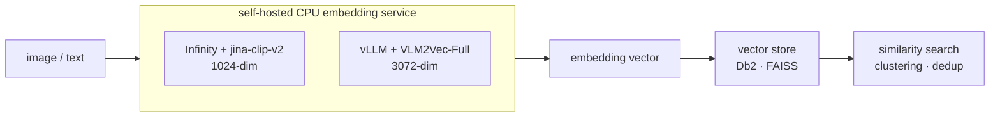

# multimodal-embeddings

Self-hosted image and text embedding services for CPU-only RHEL hosts. Each subfolder is an independent module with its own inference engine, virtualenv, and README — pick one and follow its Quick start. `curl` is the only client required.



## Modules

| Module | Engine | Model | Dim | Image input | Port | Install |
|---|---|---|---|---|---|---|
| [infinity-jina-clip-v2](infinity-jina-clip-v2/README.md) | Infinity (`infinity-emb`, torch) | `jinaai/jina-clip-v2` | 1024 | URL (no base64) | 7997 | `pip install` (pinned) |
| [vllm-vlm2vec-image-embed](vllm-vlm2vec-image-embed/README.md) | vLLM (CPU) | `TIGER-Lab/VLM2Vec-Full` | 3072 | base64 data URL | 8000 | source build¹ |

¹ This host's CPU is AVX2-only and RHEL 9.6 ships glibc 2.34, so vLLM had no installable CPU wheel and was built from source. On an AVX-512 host with glibc ≥ 2.35, a plain `pip install` works — see that module's appendix.

## Which one?

| If you want… | Use |
|---|---|
| The lighter, faster path — ~900 MB model, ~2.5 s warm, embeds image URLs directly | infinity-jina-clip-v2 |
| A vLLM walkthrough — ~8 GB model, ~22 s warm, base64 images, learning-focused | vllm-vlm2vec-image-embed |

Both put images and text in the same vector space, so you can embed a text query and compare it against image vectors.

## Shared prerequisite — fix system SQLite (RHEL 9.6, one-time, sudo)

On a fresh RHEL 9.6 image, `import sqlite3` is broken system-wide for Python 3.12: the stock `sqlite-libs-3.34.1-9.el9_7` doesn't export `sqlite3_deserialize`, which the `python3.12-libs` (el9_8) `_sqlite3` extension requires. The Infinity module imports `sqlite3` at startup and crashes without this fix, so apply it once before setup:

```bash
sudo dnf update -y sqlite-libs        # 3.34.1-9.el9_7 -> 3.34.1-10.el9_8
python3 -c "import sqlite3; print('sqlite3 OK', sqlite3.sqlite_version)"
```

If `dnf update` reports nothing to do, check whether an old SQLite is being injected via `LD_LIBRARY_PATH` (e.g. a DB2 `sqllib/lib64`) ahead of `/lib64`.

## Conventions for new modules

- One subfolder per engine/model combo, with its own `.venv` and `requirements.txt` — pin versions, since these stacks bit-rot quickly against current PyPI.
- A `README.md` per module: one-line opener, Quick start, expected output, then concepts; host-specific setup and troubleshooting in an appendix.
- Give each module a distinct port so several can run side by side.
