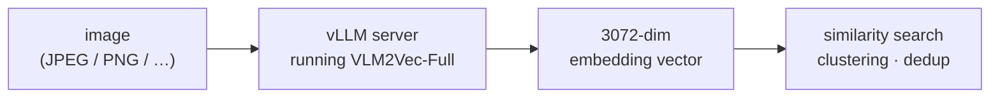

# Image embeddings with vLLM (CPU)

Turn an image into a 3072-dimensional embedding vector using a local [vLLM](https://docs.vllm.ai) server running the [`TIGER-Lab/VLM2Vec-Full`](https://huggingface.co/TIGER-Lab/VLM2Vec-Full) model. This module is a minimal, CPU-only **tutorial** — built to show the moving parts, not for production.

The sample is a JPEG, but any common image format works (PNG, WebP, …) — you set the format in the request, covered in [The API shape](#the-api-shape).



> **Tested on:** Red Hat Enterprise Linux 9.6, Python 3.12, CPU-only (no GPU), vLLM 0.22.0. This host needed a from-source build of vLLM — see [why, and how to build it](#appendix--full-setup-from-scratch).

## New to image embeddings?

If you've used **text** embeddings, this is the same idea with an image as the input. An embedding is a list of numbers (here, 3072 of them) that captures the *meaning* of the input, placing similar inputs close together in vector space. Swap "sentence" for "image" and what you already know carries over: measure similarity, cluster, deduplicate, or feed the vector to another model.

Where image embeddings get used:

- **Visual / reverse image search** — "find images like this one"
- **Near-duplicate detection** — spot re-uploads or slight edits
- **Recommendation and content grouping** — organize a photo or product library by what's in the images

VLM2Vec places images **and** text in the same vector space, so you can also search images with a text query.

> **Expect slowness on CPU.** The first request after the server starts takes ~2–3 minutes (one-time warmup); after that, each request is ~20–25 seconds. Production systems use GPUs — this runs on CPU so you can follow along on any machine.

## Run it

> **First time?** This assumes vLLM and the model are already installed in `.venv`. Starting from scratch? Do the [one-time setup](#appendix--full-setup-from-scratch) first — it installs vLLM and downloads the ~8 GB model from Hugging Face — then come back here.

**1. Start the server.**

```bash
cd vllm-vlm2vec-image-embed
source .venv/bin/activate
./serve.sh                 # launches vLLM in the background; logs go to server.log
```

**2. Wait until it's ready.** `/health` returns `200` once the model is loaded (the first start loads and warms up the model, so give it a few minutes):

```bash
curl -s -o /dev/null -w '%{http_code}\n' http://localhost:8000/health
```
```
200
```

**3. Embed the sample image.**

```bash
python embed_image.py
```
```
HTTP status: 200
Embedding dimension: 3072
First 10 values: [0.0065, 0.0142, 0.0245, 0.0220, 0.0177, ...]
```

Those 3072 floats are the embedding for the image.

**4. Stop the server when done.**

```bash
./cleanup.sh
```

## How it works

Four pieces cooperate to turn "an HTTP request with an image" into "an embedding." Knowing which is which is the key:

| Component | Role | What it is |
|---|---|---|
| **VLM2Vec-Full** | **the model** | The trained multimodal embedding model — the thing that converts an image (or text) into the 3072-dim vector. Open weights from [TIGER-Lab](https://huggingface.co/TIGER-Lab/VLM2Vec-Full), fine-tuned from Microsoft's Phi-3.5-vision. Everything else just loads, runs, or serves it. |
| **Transformers** | model loader | Hugging Face library that loads the model's architecture and weights into memory. |
| **PyTorch (CPU)** | runtime | The framework that executes the model's math (tensor operations), here on the CPU. |
| **vLLM** | serving engine | Not a model — it wraps the loaded model in an HTTP server (via FastAPI + Uvicorn) and speaks the OpenAI API, handling requests, batching, and lifecycle. |

How they stack up, bottom to top:

```
        HTTP client  (curl, or embed_image.py)
                 │   OpenAI-style JSON over HTTP
                 ▼
 ┌───────────────────────────────────────────────┐
 │ vLLM — serving engine                          │
 │   FastAPI + Uvicorn  →  HTTP endpoints         │
 │   request handling · batching · lifecycle      │
 ├───────────────────────────────────────────────┤
 │ VLM2Vec-Full — the embedding model             │
 │   loaded by Transformers from Hugging Face     │
 ├───────────────────────────────────────────────┤
 │ PyTorch (CPU) — runs the model's math          │
 ├───────────────────────────────────────────────┤
 │ Python 3.12   ·   RHEL 9.6   (CPU host)        │
 └───────────────────────────────────────────────┘
```

Read it bottom-up: Python runs PyTorch, PyTorch runs the VLM2Vec-Full model, and vLLM wraps that model in a web server your client calls. The client (`embed_image.py`) stays simple — read image, build JSON, POST, parse response — using only `requests` and the standard library.

## What happens to one request

The input is `sample.jpg` — a cat in the snow:


At the top level, treat the server as a black box: an image goes in, a vector comes out.

```
              your image
                  │  (base64 text, inside JSON)
                  ▼
        ┌────────────────────────┐
        │   vLLM server           │
        │   running VLM2Vec-Full  │
        └────────────────────────┘
                  │
                  ▼
         3072-dim embedding vector
```

Open the box and there are three steps. Watch how the data changes form at each one:

```
IN   "data:image/jpeg;base64,/9j/4gIcSUND..."   ← JSON (text)
        │
        ▼  1. decode + preprocess
     image tensor   (the pixels, as numbers)
        │
        ▼  2. forward pass through VLM2Vec-Full
     embedding tensor   (3072 numbers — the vector)
        │
        ▼  3. serialize
OUT  { "embedding": [0.0065, 0.0142, ...] }      → JSON (text)
```

- **1 · decode + preprocess** — the image arrived as a base64 *string* inside JSON. The server decodes it back to image bytes, then resizes and normalizes the pixels into an **image tensor** — the same prep you'd do before any PyTorch vision model.
- **2 · forward pass** — `vector = model(image_tensor)`, the part you already know from PyTorch. The tensor changes meaning here: the input was a grid of *pixels*; the output is the **embedding tensor**, a single list of 3072 numbers. They're two different tensors.
- **3 · serialize** — turn that 3072-number tensor into a plain list of floats and wrap it in the JSON response sent back over HTTP.

So the server is a wrapper around one familiar line — `model(image_tensor)` — with base64-decode on the way in and JSON on the way out.

## The API shape

The endpoint is OpenAI-compatible, with one twist. OpenAI's *text* embeddings endpoint takes a plain `"input": [...]` array of strings — but OpenAI has **no** image-embeddings endpoint at all. So vLLM borrowed the `messages` format from OpenAI's *vision chat* API and reused it here: same URL (`/v1/embeddings`), same response shape, but the image rides inside a chat-style `messages` array.

**Request**

```json
{
  "model": "TIGER-Lab/VLM2Vec-Full",
  "messages": [{
    "role": "user",
    "content": [
      {"type": "image_url", "image_url": {"url": "data:image/jpeg;base64,/9j/4gIc..."}},
      {"type": "text", "text": "Represent the given image."}
    ]
  }],
  "encoding_format": "float"
}
```

| Field | What it means |
|---|---|
| `model` | Which served model to use — must match what the server loaded. |
| `messages` | **The vLLM extension.** A chat-style list (here one user message) whose `content` holds the things to embed. This replaces OpenAI's text-only `input` array. |
| `content[].type: "image_url"` | Marks this content block as an image (the content type from OpenAI's vision API). |
| `image_url.url` | The image itself, inlined as a `data:<mime>;base64,<…>` URL. The MIME type (`image/jpeg`, `image/png`, …) tells the server how to decode it — that's how formats other than JPEG work. |
| `content[].type: "text"` | An instruction block. `"Represent the given image."` is VLM2Vec's prompt telling the model what to embed. |
| `encoding_format` | `"float"` returns the vector as JSON numbers. (`"base64"` would pack it as a base64 string instead.) |

**Response**

```json
{
  "object": "list",
  "data": [{
    "object": "embedding",
    "index": 0,
    "embedding": [0.00653, 0.01422, 0.02455, ...]
  }],
  "model": "TIGER-Lab/VLM2Vec-Full",
  "usage": {...}
}
```

| Field | What it means |
|---|---|
| `object: "list"` | The response is a list of results. |
| `data[]` | One entry per input you sent (here, one). |
| `data[].embedding` | The vector — 3072 floats. This is what you store and compare. |
| `data[].index` | Position matching the input order (useful when you send several at once). |
| `model` | The model that produced the embeddings. |
| `usage` | Token-count accounting for the request. |

## What's not here

Deliberately omitted: GPU support, auth, TLS, client batching, error handling, retries, vector storage. To go further:

- Store vectors in a vector store such as Db2, or a library like FAISS, for search
- Batch multiple images per request
- Embed text queries with the same model and compare against images (shared space)
- Move to a GPU host for usable latency

---

## Appendix — Full setup from scratch

Start here if `.venv` doesn't exist yet. This walks from a clean machine to a runnable module.

> **Why a source build on this host?** Two issues on this RHEL 9.6 VM force it:
> 1. **No prebuilt vLLM CPU wheel works here** — official wheels need glibc ≥ 2.35; RHEL 9.6 has 2.34.
> 2. **vLLM's CPU kernels normally require AVX-512** — this AMD EPYC VM has only AVX2.
>
> On a host with AVX-512 **and** glibc ≥ 2.35 (or the official `vllm-cpu` container), you skip the source build — see step 3, "Easy path."

### Prerequisites

A Linux x86_64 host with `sudo`, `git`, and `curl`, plus **Python 3.12** (vLLM 0.22 + torch 2.11 ship `cp312` builds). Check it, and install on RHEL/Fedora if missing:

```bash
python3.12 --version || sudo dnf install -y python3.12
```

(On other distros, install Python 3.12 with your package manager, or use `pyenv`.)

### 1. Clone the repo and enter this module

```bash
git clone https://github.com/shaikhq/multimodal-embeddings.git
cd multimodal-embeddings/vllm-vlm2vec-image-embed
```

### 2. Create the module's virtualenv

```bash
python3.12 -m venv .venv
source .venv/bin/activate
pip install -U pip
```

### 3. Install vLLM

**Easy path — AVX-512 CPU and glibc ≥ 2.35.** A prebuilt wheel just works:

```bash
pip install vllm --extra-index-url https://wheels.vllm.ai/cpu
```

**This host — AVX2-only CPU and/or glibc 2.34.** Build vLLM from source instead:

```bash
# 3a. System build deps (gcc ≥ 12.3 required for vLLM's x86 CPU backend)
sudo dnf install -y python3.12-devel numactl-devel gcc-toolset-13

# 3b. vLLM source + its CPU dependency set (pulls torch 2.11.0+cpu)
git clone --depth 1 --branch v0.22.0 https://github.com/vllm-project/vllm.git /tmp/vllm-build
cd /tmp/vllm-build
pip install "cmake>=3.26" wheel packaging ninja setuptools-rust setuptools-scm jinja2
pip install -r requirements/cpu.txt --extra-index-url https://download.pytorch.org/whl/cpu
pip install "torchvision==0.26.0+cpu" "torchaudio==2.11.0+cpu" \
  --extra-index-url https://download.pytorch.org/whl/cpu

# 3c. AVX2-only patch — build _C from AVX2 sources instead of AVX-512+AMX.
#     UNSUPPORTED; only because this CPU lacks AVX-512. Drops kernels (AVX-512/AMX,
#     shared-mem TP, MoE, weight-only quant) a single-process dense embedding model doesn't use.
sed -i 's#SOURCES ${VLLM_EXT_SRC_AVX512} ${VLLM_EXT_SRC_SGL}#SOURCES ${VLLM_EXT_SRC_AVX2}#' cmake/cpu_extension.cmake
sed -i 's#COMPILE_FLAGS ${CXX_COMPILE_FLAGS_AVX512_AMX}#COMPILE_FLAGS ${CXX_COMPILE_FLAGS_AVX2}#' cmake/cpu_extension.cmake
sed -i '/target_compile_definitions(_C PRIVATE "-DCPU_CAPABILITY_AMXBF16")/d' cmake/cpu_extension.cmake

# 3d. Compile (~15 min on 16 cores)
source /opt/rh/gcc-toolset-13/enable
export VLLM_TARGET_DEVICE=cpu CC=$(which gcc) CXX=$(which g++) CMAKE_BUILD_PARALLEL_LEVEL=$(nproc)
pip install . --no-build-isolation

# 3e. Verify the kernels load on this CPU (must NOT print "Illegal instruction")
python3 -c "import vllm._C; print('vllm._C OK on AVX2')"

cd ~/multimodal-embeddings/vllm-vlm2vec-image-embed   # back to the module
```

Sanity checks (source build): `python3 -c "import torch; print(torch.__version__)"` → `2.11.0+cpu`; `python3 -c "from vllm.platforms import current_platform; print(current_platform.is_cpu())"` → `True`. `/tmp/vllm-build` can be deleted afterward.

### 4. Install the client dependency

```bash
pip install requests
```

The sample image `sample.jpg` already ships with the repo — no download needed. To embed your own image, drop any JPEG/PNG in as `sample.jpg`.

### 5. Run it

The model (~8 GB) downloads from Hugging Face on the first `./serve.sh`. Then follow [Run it](#run-it) above to start the server and embed the image.
